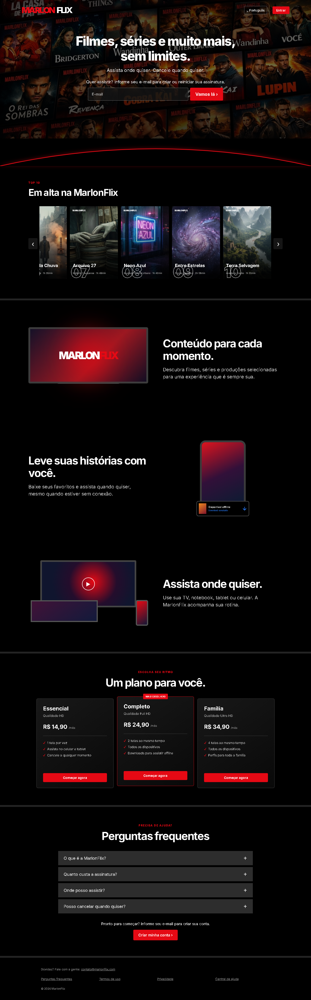

# 🎬 MarlonFlix

Landing page inspirada na Netflix, construída com HTML, CSS e JavaScript puro (sem frameworks). Projeto de portfólio focado em replicar a experiência visual e de interação da página inicial da Netflix.

## 🔗 Links

- **💻 Demonstração:** [netflix-clone-three-gamma-29.vercel.app](https://netflix-clone-three-gamma-29.vercel.app)
- **📂 Código-fonte:** [github.com/marlonjc35/netflix-clone](https://github.com/marlonjc35/netflix-clone)



## ✨ Funcionalidades

- **Hero section** com fundo, formulário de email e arco separador vermelho
- **Top 10 filmes** em carrossel horizontal com posters, sinopses e numeração estilo Netflix
- **Modal interativo** — clique em qualquer filme para ver poster, sinopse e detalhes
- **Bilíngue (PT/EN)** — alternância de idioma em tempo real com persistência em localStorage
- **Seções de benefícios** com ilustrações em CSS (TV, smartphone, dispositivos)
- **Planos de assinatura** com 3 níveis (Essencial, Completo, Família)
- **FAQ** com accordion interativo
- **Responsivo** — adaptado para desktop, tablet e mobile
- **Favicon personalizado**

## 🛠️ Tecnologias

- HTML5 (estruturação semântica e acessibilidade ARIA)
- CSS3 (flexbox, grid, animações, media queries)
- JavaScript Vanilla (DOM, eventos, i18n)
- Google Fonts (fonte Inter)

## 🎞️ Filmes do catálogo

Todos os 10 títulos e sinopses são **100% fictícios e originais**, sem qualquer vínculo com obras reais.

## 📁 Estrutura

```
netflix-clone/
├── index.html
├── assets/
│   ├── css/style.css
│   ├── js/script.js
│   ├── icons/              (favicon)
│   └── images/
│       ├── hero-bg.jpg
│       ├── screenshot.png
│       └── posters/         (10 posters SVG + 5 PNG)
└── README.md
```

## 🚀 Como executar

1. Clone o repositório:
   ```bash
   git clone https://github.com/marlonjc35/netflix-clone.git
   ```
2. Abra o arquivo `index.html` no navegador.


## 📄 Licença

Projeto de portfólio. Todos os filmes, títulos e sinopses são fictícios.
